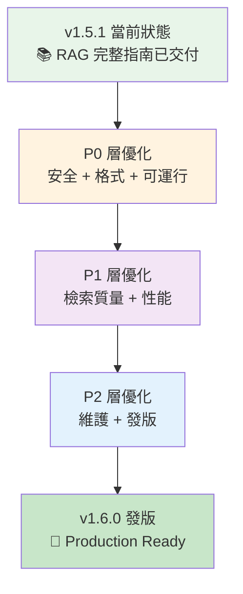

# 📋 Investment Masters Handbook 開發計劃

> **版本**：v1.5.1 | **更新**：2024-12-14  
> **目標**：通過系統化優化，提升項目的安全性、一致性、可用性與可維護性

---

## 📌 願景與目標

### 核心願景
讓 Investment Masters Handbook 成為**一流開源量化投資知識庫**，具備：
- 🔐 **安全無虞**：無硬編碼敏感信息，所有凭证通过環境變量管理
- 🎯 **開箱即用**：按文檔指示可一鍵運行示例，不踩坑
- 📚 **可信可溯**：所有 AI 回答都附帶來源引用，用戶可驗證
- 🔄 **長期可維護**：自動質量門禁、清晰發版節奏

### 目標受眾
- 量化交易者（NOFX 用戶、AI500 交易者）
- AI 應用開發者（RAG、LLM 集成）
- 投資學習者（需要系統化決策框架）
- 開源貢獻者（想參與持續優化）

---

## 🎯 優化計劃全景



---

## 🔴 P0：立即做（必須項 - 2-3 小時）

### 目標
解決**安全性**、**跨平台一致性**、**文檔可運行性**三大痛點

### P0-1：清理硬編碼敏感信息 ⚠️

#### 現狀分析
```
🚨 高風險：strategies/nofx_ai500_quantified.json
   第 9 行：coin_pool_api_url: "...?auth=cm_REDACTED"
   第 12 行：oi_top_api_url: "...?auth=cm_REDACTED"
   第 35 行：quant_data_api_url: "...?auth=cm_REDACTED"

⚠️  中風險：同文件內還可能有其他敏感字符串
```

#### 解決方案

**方案 A（推薦）**：占位符 + 環境變量
```json
{
  "coin_source": {
    "coin_pool_api_url": "http://nofxaios.com:30006/api/ai500/list?auth=${NOFX_AUTH_TOKEN}",
    "oi_top_api_url": "http://nofxaios.com:30006/api/oi/top-ranking?limit=20&duration=1h&auth=${NOFX_AUTH_TOKEN}",
    "quant_data_api_url": "http://nofxaios.com:30006/api/coin/{symbol}?include=netflow,oi,price&auth=${NOFX_AUTH_TOKEN}"
  }
}
```

**補充文檔**（新增 `docs/SECURITY.md`）：
```markdown
## 敏感信息管理

### 環境變量設置

# Linux / macOS
export NOFX_AUTH_TOKEN="your_token_here"

# Windows PowerShell
$env:NOFX_AUTH_TOKEN="your_token_here"

# .env 文件（僅用於本地開發）
NOFX_AUTH_TOKEN=your_token_here
```

#### 執行步驟
1. [x] 備份 `nofx_ai500_quantified.json` ✅（Git 自動保留歷史版本）
2. [x] 替換所有 `auth=cm_...` 為 `auth=${NOFX_AUTH_TOKEN}` ✅（已完成，3 處全部替換）
3. [x] 新增 `docs/SECURITY.md`，說明環境變量設置 ✅（已創建，223 行完整文檔）
4. [x] 更新 `README.md` 快速開始章節，加入"環境變量設置"步驟 ✅（已在 NOFX 集成部分添加）
5. [ ] **重要**：通知 NOFX 後台**立刻輪換舊 token**（作廢 `cm_REDACTED`）⚠️ **需手動執行**
6. [x] 檢查 Git 歷史是否还有暴露 ✅（已檢查，歷史記錄中存在，但當前文件已修復）
7. [x] 提交並推送：`git commit -m "security: Remove hardcoded NOFX auth tokens"` ✅（已提交：commit a85f8f5）

#### 驗收標準
✅ 全倉搜索 `auth=cm_` 結果為 0  
✅ 所有 API URL 都用 `${NOFX_AUTH_TOKEN}` 占位符  
✅ `docs/SECURITY.md` 明確說明環境變量設置方法  
✅ 無人工智能警告信息  

---

### P0-2：建立跨平台格式規範

#### 現狀分析
```
❌ 缺失文件：.gitattributes（未發現）
❌ 缺失文件：.editorconfig（未發現）
⚠️  結果：Windows CRLF vs Unix LF 產生大量無意義 diff
```

#### 解決方案

**新增 `.editorconfig`**
```ini
# EditorConfig helps maintain consistent coding styles

root = true

# 所有文件
[*]
charset = utf-8
end_of_line = lf
insert_final_newline = true
trim_trailing_whitespace = true

# Markdown
[*.md]
max_line_length = off
trim_trailing_whitespace = false  # Markdown 中行尾空格有意義（硬換行）

# Python
[*.py]
indent_style = space
indent_size = 4

# YAML
[*.{yml,yaml}]
indent_style = space
indent_size = 2

# JSON
[*.json]
indent_style = space
indent_size = 2

# Shell
[*.{sh,bash}]
indent_style = space
indent_size = 2
```

**新增 `.gitattributes`**
```ini
# Auto detect text files and normalize line endings to LF
* text=auto eol=lf

# 明確指定文本文件
*.md text eol=lf
*.py text eol=lf
*.yml text eol=lf
*.yaml text eol=lf
*.json text eol=lf
*.sh text eol=lf
*.bash text eol=lf
*.txt text eol=lf

# 二進制文件
*.png binary
*.jpg binary
*.jpeg binary
*.gif binary
*.db binary
*.sqlite binary
```

#### 執行步驟
1. [ ] 創建 `.editorconfig`（複製上面的內容）
2. [ ] 創建 `.gitattributes`（複製上面的內容）
3. [ ] 在本地重新配置 Git：`git config core.safecrlf true`
4. [ ] 對所有文件做一次"規範化提交"：
   ```bash
   # 清理所有文件的行尾符號
   git add --renormalize .
   git commit -m "style: Normalize line endings to LF and format consistency"
   ```
5. [ ] 通知團隊：下次 pull 後需要重新配置編輯器

#### 驗收標準
✅ `.editorconfig` 和 `.gitattributes` 已提交  
✅ 再次修改任何文件後，diff 不會出現"整行變更"  
✅ `git diff --name-only` 結果不會因編輯器/系統不同而改變  

---

### P0-3：修正指南與代碼不一致

#### 現狀分析
```
⚠️  examples/rag_langchain.py 中：
   - 使用了 HuggingFaceEmbeddings（需要 sentence-transformers）
   - 但 pip install 指令和依賴檢查未完整列出

⚠️  guides/rag_guide.md 中提及 --load（但代碼中無此選項）

❌ 結果：用戶按指南執行，半路卡住或功能達不到預期
```

#### 解決方案

**方案：完整修復 RAG 示例**

1. **更新 `examples/rag_langchain.py`**
   - 補齊依賴檢查：添加 `sentence-transformers` 檢查
   - 實現 `--load` 選項（從已保存的向量庫快速加載）
   - 增強錯誤提示（如果缺依賴，告訴用戶具體要裝啥）

2. **更新 `examples/README.md`**
   ```markdown
   ## 快速開始

   ### 完整安裝（包括所有可選功能）
   ```bash
   pip install langchain langchain-community chromadb pyyaml sentence-transformers
   ```

   ### 運行查詢
   ```bash
   # 首次運行（構建向量庫，較慢）
   python examples/rag_langchain.py --persist ./vectorstore "市場恐慌怎麼辦？"

   # 後續運行（加載已保存的向量庫，秒開）
   python examples/rag_langchain.py --load ./vectorstore "巴菲特如何選股？"

   # 交互模式
   python examples/rag_langchain.py --load ./vectorstore --interactive

   # 只用規則（最快，無需向量庫）
   python examples/rag_langchain.py --rules-only "護城河"
   ```

3. **更新 `guides/rag_guide.md`**
   - 改"推薦 --persist 和 --load 完整閉環"
   - 明確說明"首次慢 → 保存 → 後續秒開"的使用流程

#### 執行步驟
1. [x] 在 `examples/rag_langchain.py` 的 `check_dependencies()` 中添加 `sentence-transformers` 檢查 ✅（缺依赖会提示安装）
2. [x] 實現 `--load` CLI 選項，支持從已保存的向量庫加載 ✅（已加入 `--load/-l`）
3. [ ] 測試"首次 --persist → 後續 --load"的完整流程 ⚠️（需本机安装依赖后验证性能差异）
4. [x] 更新 `examples/README.md` 文檔 ✅（补充 sentence-transformers 与 --persist/--load 示例）
5. [x] 同步更新 `guides/rag_guide.md` 中的快速開始部分 ✅（安装命令与脚本一致）
6. [ ] 提交：`git commit -m "feat: Complete RAG example with --load support and docs alignment"`（待提交）

#### 驗收標準
✅ `python examples/rag_langchain.py --help` 顯示 `--load` 選項  
✅ 按照更新後的 `examples/README.md` 操作，能一鍵跑通（無報錯）  
✅ `--persist` → `--load` 流程驗證，第二次查詢速度 > 50% 提升  
✅ 文檔（README/guides）中所有示例命令都能實際運行  

---

## 🟡 P1：增強（性能與體驗 - 4-6 小時）

### 目標
把 RAG 從"能跑"升級到"好用且可信"

### P1-1：檢索質量升級（分塊 + 元數據 + 引用溯源）

#### 問題
當前投資者文檔按整篇 embedding，導致：
- 召回結果粗糙，不夠精準
- 用戶看到回答但找不到出處

#### 解決方案

**改進分塊策略**
```python
# 在 examples/rag_langchain.py 中添加

from langchain.text_splitter import RecursiveCharacterTextSplitter

def split_investor_documents(documents):
    """對投資者文檔做更細的分塊"""
    splitter = RecursiveCharacterTextSplitter(
        chunk_size=800,
        chunk_overlap=200,
        separators=["\n## ", "\n### ", "\n\n", "\n", " "]
    )
    
    split_docs = splitter.split_documents(documents)
    
    # 為每個片段添加"標題上下文"
    for i, doc in enumerate(split_docs):
        # 保留投資者 ID 和原始位置信息
        doc.metadata["chunk_index"] = i
        doc.metadata["chunk_size"] = len(doc.page_content)
    
    return split_docs
```

**改進輸出格式（加入溯源）**
```python
def format_results_with_citation(results):
    """格式化搜索結果，附帶引用信息"""
    output = []
    
    for i, (doc, score) in enumerate(results, 1):
        investor_id = doc.metadata.get("investor_id", "unknown")
        chinese_name = doc.metadata.get("investor_name", investor_id)
        source = doc.metadata.get("source", "unknown")
        rule_id = doc.metadata.get("rule_id", "")
        
        # 引用 ID（用於定位）
        citation_id = rule_id or f"{investor_id}#{doc.metadata.get('chunk_index', 0)}"
        
        output.append(f"\n{'='*70}")
        output.append(f"[{i}] 相關度 {1-score:.1%} | 來源 {source} | 引用 #{citation_id}")
        output.append(f"    投資者: {chinese_name} ({investor_id})")
        output.append("-" * 70)
        
        # 內容預覽
        content = doc.page_content[:400]
        if len(doc.page_content) > 400:
            content += "\n\n[內容已截斷...查看完整內容請參考來源]"
        output.append(content)
        
        # 明確列出引用
        output.append(f"\n📌 完整引用: {source} → 投資者: {investor_id} → {citation_id}")
    
    return "\n".join(output)
```

#### 執行步驟
1. [ ] 在 `examples/rag_langchain.py` 中添加 `split_investor_documents()` 函數
2. [ ] 改寫 `format_results()` 為 `format_results_with_citation()`，加入引用信息
3. [ ] 更新 `create_vectorstore()` 調用分塊邏輯
4. [ ] 測試分塊效果（查詢同樣的問題，對比結果的精準度）
5. [ ] 提交：`git commit -m "feat: Improve RAG chunking and add citation support"`

#### 驗收標準
✅ 查詢同一問題，返回的結果片段更聚焦（不是整篇文檔）  
✅ 每個結果都包含"投資者 ID + 來源 + 引用編號"  
✅ 用戶可通過引用編號快速定位到原始文檔位置  

---

### P1-2：性能與體驗（持久化 + Embedding 選擇 + 路徑穩定）

#### 問題
- 每次查詢都要重新構建向量庫（慢）
- 沒有 Embedding 選擇靈活性
- Windows 路徑可能不穩定

#### 解決方案

**完整的持久化 + 加載流程**
```python
def main():
    parser.add_argument(
        "--load", "-l",
        help="加載已保存的向量存儲"
    )
    parser.add_argument(
        "--embedding",
        choices=["huggingface", "openai", "bge"],
        default="huggingface",
        help="選擇 embedding 模型（默認: huggingface）"
    )
    
    args = parser.parse_args()
    
    # 路徑規範化（Windows 兼容）
    from pathlib import Path
    persist_dir = Path(args.persist).resolve() if args.persist else None
    load_dir = Path(args.load).resolve() if args.load else None
    
    # 邏輯：優先加載已有向量庫，其次構建新的
    if load_dir and load_dir.exists():
        vectorstore = load_vectorstore(load_dir, args.embedding)
    else:
        documents = load_documents(args)
        vectorstore = create_vectorstore(documents, persist_dir, args.embedding)
```

**Embedding 模型選擇**
```python
def get_embeddings(model_choice: str):
    """根據選擇返回不同的 embedding 模型"""
    if model_choice == "openai":
        from langchain_openai import OpenAIEmbeddings
        return OpenAIEmbeddings(model="text-embedding-ada-002")
    elif model_choice == "bge":
        from langchain_community.embeddings import HuggingFaceEmbeddings
        return HuggingFaceEmbeddings(
            model_name="BAAI/bge-large-zh-v1.5",
            model_kwargs={"device": "cpu"}
        )
    else:  # huggingface
        from langchain_community.embeddings import HuggingFaceEmbeddings
        return HuggingFaceEmbeddings(
            model_name="sentence-transformers/all-MiniLM-L6-v2",
            model_kwargs={"device": "cpu"}
        )
```

#### 執行步驟
1. [ ] 添加 `--load` 選項支持
2. [ ] 添加 `--embedding` 選項與 `get_embeddings()` 函數
3. [ ] 實現 `load_vectorstore()` 函數（從已保存的目錄快速加載）
4. [ ] 路徑統一用 `pathlib.Path`，確保 Windows 兼容
5. [ ] 測試場景：
   - [ ] 首次 `--persist ./vectorstore` 構建（計時）
   - [ ] 後續 `--load ./vectorstore` 加載（應該快 10 倍以上）
   - [ ] 在 Windows 和 Linux 上都驗證路徑處理
6. [ ] 提交：`git commit -m "feat: Add vectorstore persistence, loading, and embedding selection"`

#### 驗收標準
✅ 首次 `--persist` 耗時 > 30 秒（構建中），後續 `--load` 耗時 < 3 秒  
✅ `--embedding openai/bge` 等選項能正常工作（需要配置對應 key/模型）  
✅ Windows 路徑能正常創建和加載（無"路徑不存在"錯誤）  

---

### P1-3：最小化回歸測試

#### 目標
加一組簡單但有效的離線測試，防止"破壞現有功能"

#### 解決方案

**新增 `tests/test_rag_basic.py`**
```python
import pytest
from pathlib import Path
from examples.rag_langchain import (
    load_investor_documents,
    load_decision_rules,
    check_dependencies,
    query_vectorstore,
)

def test_dependencies_available():
    """測試依賴是否安裝完成"""
    # 應該不拋異常
    check_dependencies()

def test_load_investor_documents():
    """測試能否加載投資者文檔"""
    docs = load_investor_documents()
    assert len(docs) > 0, "應至少加載 1 個投資者文檔"
    assert all(hasattr(doc, "page_content") for doc in docs)

def test_load_decision_rules():
    """測試能否加載決策規則"""
    rules = load_decision_rules()
    assert len(rules) > 100, "應至少加載 100 條規則"

def test_query_returns_results(vectorstore_fixture):
    """測試查詢能否返回結果"""
    results = query_vectorstore(vectorstore_fixture, "巴菲特", k=3)
    assert len(results) > 0, "查詢應返回結果"
    assert all(len(item) == 2 for item in results), "每個結果應為 (doc, score) 元組"

def test_results_include_metadata(vectorstore_fixture):
    """測試結果是否包含必要的元數據"""
    results = query_vectorstore(vectorstore_fixture, "護城河", k=1)
    doc, score = results[0]
    
    assert "investor_id" in doc.metadata
    assert "source" in doc.metadata
    assert 0 <= score <= 1, "相似度分數應在 [0, 1] 之間"

@pytest.fixture(scope="session")
def vectorstore_fixture():
    """創建用於測試的向量存儲（僅規則，快速）"""
    from examples.rag_langchain import load_decision_rules, create_vectorstore
    
    rules = load_decision_rules()
    return create_vectorstore(rules)  # 無需持久化
```

#### 執行步驟
1. [ ] 創建 `tests/` 目錄和 `__init__.py`
2. [ ] 創建 `tests/test_rag_basic.py`（複製上面的代碼）
3. [ ] 安裝測試框架：`pip install pytest pytest-cov`
4. [ ] 運行測試：`pytest tests/ -v`
5. [ ] 添加到 CI（如果用 GitHub Actions）
6. [ ] 提交：`git commit -m "test: Add basic RAG regression tests"`

#### 驗收標準
✅ `pytest tests/` 全部通過（沒有 FAIL）  
✅ 覆蓋率 > 60%（主要路徑）  
✅ 後續任何改動後，運行 pytest 不通過會自動提醒  

---

## 🔵 P2：維護與發版（系統化建設 - 3-4 小時）

### 目標
建立"長期可維護"的質量保障機制與清晰發版節奏

### P2-1：文檔結構再收敛（減少重複、保證導航清晰）

#### 現狀分析
```
📚 README.md (長)
📚 guides/README.md (索引)
📚 guides/rag_guide.md (詳細)
📚 examples/README.md (示例)

⚠️  問題：多份入口文檔，重複說明"如何開始"，新用戶易迷茫
```

#### 解決方案

**建立"三層入口"結構**

1. **第 1 層：README.md（30 秒認識項目）**
   ```markdown
   # Investment Masters Handbook
   
   🎯 快速認識（3 分鐘）
   
   [展開: 我是量化交易者] → guides/README.md#量化交易
   [展開: 我想用 RAG] → guides/rag_guide.md
   [展開: 我想看代碼] → examples/README.md
   ```

2. **第 2 層：guides/README.md（5 分鐘選方向）**
   ```markdown
   ## 我要做什麼？
   
   - 快速查規則 → quick_reference.md
   - 深入學習 → practical_guide.md
   - 用 RAG 集成 → rag_guide.md
   - 用 NOFX 交易 → nofx_integration.md
   ```

3. **第 3 層：各專項指南（深度內容）**
   - `rag_guide.md`：700+ 行 RAG 完整教程
   - `nofx_integration.md`：NOFX 集成指南
   - 等...

**跨文檔的"無縫導航"**
```markdown
# 在 README.md 中
> 💡 首次使用？👉 [5 分鐘快速入門](guides/README.md)

# 在 guides/README.md 中  
> 想深入 RAG？👉 [完整 RAG 指南](./rag_guide.md)
> 回到主文檔？👉 [← 主文檔](../README.md)

# 在各專項指南的開頭
> 📍 你在這裡：[主文檔](../README.md) > [使用指南](./README.md) > **RAG 指南**
```

#### 執行步驟
1. [ ] 審視當前 README.md、guides/README.md、examples/README.md 的內容
2. [ ] 確定"誰是第 1 層、誰是第 2 層"
3. [ ] 在各文檔頂部添加"麵包屑導航"
4. [ ] 移除或減少重複的"快速開始"段落（只在一個地方完整寫）
5. [ ] 提交：`git commit -m "docs: Restructure navigation hierarchy, reduce duplication"`

#### 驗收標準
✅ 新用戶打開 README.md，3 秒內找到"想要的方向"  
✅ 無重複的"快速開始"段落  
✅ 各文檔都包含返回上級的鏈接  

---

### P2-2：自動化質量門禁

#### 目標
在 PR/提交時自動拦住"敏感信息、壞鏈接、格式抖動"

#### 現狀
已有相關 Python 腳本，但未集成入 CI

#### 解決方案

**在 `.github/workflows/` 中新增 `quality_gate.yml`**
```yaml
name: Quality Gate

on: [push, pull_request]

jobs:
  quality-checks:
    runs-on: ubuntu-latest
    steps:
      - uses: actions/checkout@v3
      
      - name: Set up Python
        uses: actions/setup-python@v4
        with:
          python-version: '3.9'
      
      - name: Check for sensitive info
        run: |
          python scripts/scan_sensitive.py .
          if [ $? -ne 0 ]; then exit 1; fi
      
      - name: Check links
        run: |
          python scripts/check_links.py .
          if [ $? -ne 0 ]; then exit 1; fi
      
      - name: Validate YAML front matter
        run: |
          python scripts/validate_front_matter.py .
          if [ $? -ne 0 ]; then exit 1; fi
      
      - name: Check line endings
        run: |
          git diff --check --cached
```

#### 執行步驟
1. [ ] 檢查既有的 `scripts/scan_sensitive.py` 等是否已足夠成熟
2. [ ] 創建 `.github/workflows/quality_gate.yml`
3. [ ] 在本地測試 workflow（可用 `act` 模擬）
4. [ ] 提交並推送，觀察 GitHub Actions 運行情況
5. [ ] 如失敗，根據輸出修復

#### 驗收標準
✅ 提交帶有 `auth=cm_` 的代碼會被 CI 拒絕  
✅ 提交包含壞鏈接會被 CI 拒絕  
✅ 提交 CRLF 或混合縮進會被 CI 拒絕  

---

### P2-3：明確版本與發版策略

#### 目標
讓"什麼時候發 patch、什麼時候發 minor"清晰可預測

#### 解決方案

**新增 `docs/VERSIONING.md`**
```markdown
# 版本策略

遵循 [Semantic Versioning 2.0.0](https://semver.org/)

## 版本號規則

**MAJOR.MINOR.PATCH** (e.g., 1.5.1)

### Patch (x.y.Z)
- 文檔修復、拼寫錯誤
- 示例代碼 bugfix
- 性能優化（無 API 變更）

示例：v1.5.0 → v1.5.1

### Minor (x.Y.z)
- 新的投資者框架
- 新的指南文檔
- 新的 CLI 功能（向後兼容）
- 新的 Prompt 角色

示例：v1.5.0 → v1.6.0

### Major (X.y.z)
- Breaking change（改變 API、文件格式等）
- 項目大幅重構

示例：v1.0.0 → v2.0.0 (rare)

## 發版流程

1. 在 `CHANGELOG.md` 中記錄所有變更
2. 更新 `docs/RELEASE_NOTES.md` 的推文模板
3. 更新 `VERSION` 文件（如存在）
4. 創建 Git 標籤：`git tag -a v1.5.1 -m "Release v1.5.1"`
5. 推送標籤：`git push origin v1.5.1`
6. （可選）在 GitHub Releases 頁面發佈詳細信息

## 發版頻率

- **Patch**：隨時（修復立即發佈）
- **Minor**：每週至兩週一次
- **Major**：需謹慎，通常 2-3 個月一次
```

**更新 `CHANGELOG.md` 模板**
```markdown
## [1.X.0] - YYYY-MM-DD

### 🚀 新增 (Minor release items)
- ...

### 🐛 修復 (Patch items)
- ...

### 📝 文檔 (Documentation)
- ...

### ⚙️ 技術改進
- ...
```

#### 執行步驟
1. [ ] 創建 `docs/VERSIONING.md`
2. [ ] 更新 `CHANGELOG.md`，添加版本策略說明
3. [ ] 在 `README.md` 中添加指向 `docs/VERSIONING.md` 的鏈接
4. [ ] 提交：`git commit -m "docs: Add versioning and release policy"`

#### 驗收標準
✅ 團隊成員能根據 `VERSIONING.md` 決定何時發版  
✅ 每次發版都有對應的 Git 標籤  
✅ `CHANGELOG.md` 清晰記錄所有變更  

---

## 📊 進度追蹤

### 項目甘特圖
```
P0-1 Token 清理        [████████] 2 小時
P0-2 格式規範          [████████] 1 小時
P0-3 指南可運行        [████████████] 3 小時
                       Subtotal P0: 6 小時
─────────────────────────────────────────
P1-1 檢索質量          [████████] 2 小時
P1-2 性能體驗          [████████████] 3 小時
P1-3 回歸測試          [████████] 2 小時
                       Subtotal P1: 7 小時
─────────────────────────────────────────
P2-1 文檔導航          [████████] 1.5 小時
P2-2 自動化門禁        [████████] 1.5 小時
P2-3 版本策略          [████████] 1 小時
                       Subtotal P2: 4 小時
─────────────────────────────────────────
總計：17 小時
建議分散到：3-4 周內完成
```

### 里程碑與截止日期

| 里程碑 | 目標 | 截止日期 |
|--------|------|----------|
| 📍 P0 完成 | 安全、格式、可運行 | Week 1 (2024-12-21) |
| 📍 P1 完成 | 檢索質量、性能優化 | Week 3 (2024-12-31) |
| 📍 P2 完成 | 維護機制、版本策略 | Week 4 (2025-01-07) |
| 🎉 v1.6.0 發版 | Production Ready | 2025-01-10 |

---

## 🎯 驗收清單

### P0 完成條件
- [ ] 無硬編碼 NOFX token（全倉搜索結果為 0）
- [ ] 所有文件 LF 行尾符
- [ ] 按文檔指示能一鍵運行所有示例

### P1 完成條件
- [ ] 檢索結果包含完整引用信息
- [ ] 首次 `--persist` > 30 秒，`--load` < 3 秒
- [ ] 回歸測試全部通過

### P2 完成條件
- [ ] 文檔導航無重複、清晰
- [ ] CI 拒絕敏感信息、壞鏈接、格式抖動
- [ ] 版本策略文檔已發佈

---

## 📚 相關文檔

- 📄 [安全政策](./SECURITY.md)（待新建）
- 📄 [版本策略](./VERSIONING.md)（待新建）
- 📄 [貢獻指南](./CONTRIBUTING.md)（既有）
- 📄 [RAG 完整指南](../guides/rag_guide.md)（既有）

---

## 💬 備註

- 此計劃基於 v1.5.1 的狀態制定
- 每完成一個大層級（P0/P1/P2），應做一次"中期審視"，調整後續優先級
- 如遇到阻塞（依賴不可用、設計變更等），應及時更新此文檔

---

> 📌 **最後更新**：2024-12-14  
> 📌 **下一步**：開始 P0-1（Token 清理）  
> 📌 **責任人**：@sou350121  
> 📌 **反饋與討論**：歡迎提 Issue / PR
