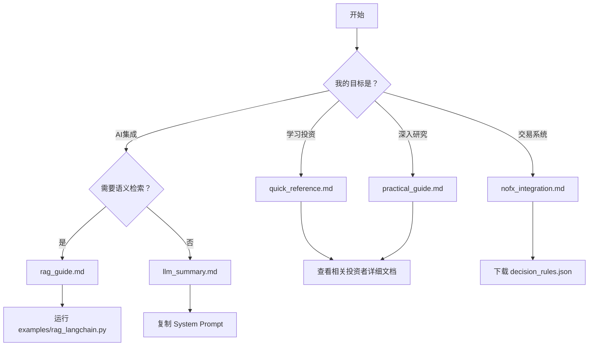

# 📖 使用指南索引

本目录包含 Investment Masters Handbook 的所有核心使用指南。

---

## 核心指南

| 指南 | 说明 | 适用人群 |
|------|------|----------|
| [llm_summary.md](./llm_summary.md) | LLM System Prompt 模板 | AI 开发者、想要快速集成的用户 |
| [practical_guide.md](./practical_guide.md) | 200+ IF-THEN 实战规则 | 投资者、需要快速决策参考的用户 |
| [quick_reference.md](./quick_reference.md) | 一页速查卡片 | 所有用户（最常用） |
| [rag_guide.md](./rag_guide.md) | RAG 检索增强生成指南 | AI 开发者、需要深度集成的用户 |
| [nofx_integration.md](./nofx_integration.md) | NOFX 交易系统集成 | 量化交易者、NOFX 用户 |

---

## 快速导航

### 我想快速查规则

→ [quick_reference.md](./quick_reference.md) - 一页纸掌握 17 位大师核心智慧

**适用场景**：
- 选股前快速检查
- 做决策时对照清单
- 移动端随时查阅

---

### 我想深入学习某个主题

→ [practical_guide.md](./practical_guide.md) - 200+ IF-THEN 规则按场景分类

**适用场景**：
- 系统学习投资框架
- 场景化决策参考
- 打印后线下学习

---

### 我想集成到 AI 系统

→ [rag_guide.md](./rag_guide.md) - RAG 检索增强生成完整指南

**适用场景**：
- 构建投资顾问 AI
- 语义检索大师智慧
- 多轮对话上下文

**或者** → [llm_summary.md](./llm_summary.md) - 直接作为 System Prompt

**适用场景**：
- 快速原型
- 轻量级集成
- 无需向量数据库

---

### 我想集成到量化交易系统

→ [nofx_integration.md](./nofx_integration.md) - NOFX 集成指南

**适用场景**：
- NOFX 用户
- 自动化交易系统
- 需要实时决策

---

## 使用流程建议

---

## 相关资源

### 投资者详细框架
- [investors/](../investors/) - 17 位大师的完整决策框架

### 配置文件
- [config/investor_index.yaml](../config/investor_index.yaml) - 投资人结构化索引
- [config/decision_rules.generated.json](../config/decision_rules.generated.json) - 232 条机读规则

### 示例代码
- [examples/rag_langchain.py](../examples/rag_langchain.py) - RAG 检索示例
- [tools/rule_query.py](../tools/rule_query.py) - 规则查询 CLI

### AI 角色 Prompt
- [prompts/](../prompts/) - 7 个神级 Prompt 角色

---

## 常见问题

### Q: 新手应该从哪里开始？

**A**: 
1. 先看 [quick_reference.md](./quick_reference.md) 了解整体框架
2. 选择 3-5 位与你投资风格接近的大师深入学习
3. 使用 [practical_guide.md](./practical_guide.md) 作为决策清单

---

### Q: 如何选择合适的集成方式？

**A**:

| 需求 | 推荐方案 | 难度 |
|------|----------|------|
| 快速原型 | llm_summary.md | ⭐ |
| 深度集成 | rag_guide.md | ⭐⭐⭐ |
| 交易系统 | nofx_integration.md | ⭐⭐ |
| CLI 查询 | tools/rule_query.py | ⭐ |

---

### Q: 文档太多，记不住怎么办？

**A**: 
- 收藏 [quick_reference.md](./quick_reference.md)
- 打印速查卡随身携带
- 使用 RAG 系统随时检索

---

## 贡献指南

想要改进这些指南？查看 [../docs/CONTRIBUTING.md](../docs/CONTRIBUTING.md)

---

> 💡 **提示**：这些指南会持续更新。建议 Watch 项目获取最新版本。
