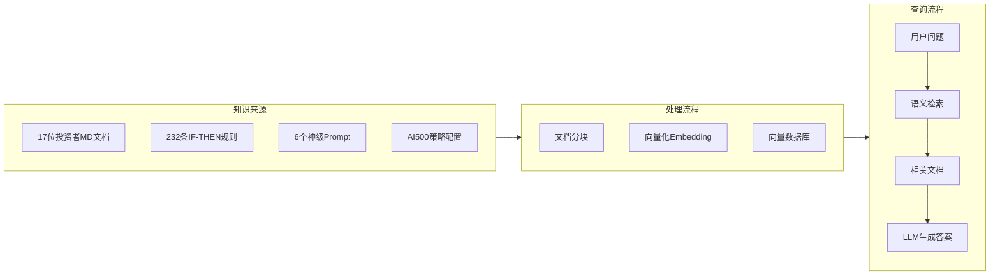

# 📚 RAG 检索增强生成指南

> **版本**：v1.5.0 | **更新**：2024-12-14

本指南介绍如何使用 RAG（Retrieval-Augmented Generation）技术，将 Investment Masters Handbook 的 17 位大师智慧应用到实际投资决策中。

---

## 什么是 RAG？

**RAG（Retrieval-Augmented Generation）** = 检索 + 增强 + 生成

```
传统 LLM：
用户问题 → LLM → 答案（受限于训练数据）

RAG 增强：
用户问题 → 检索相关知识 → LLM + 知识库 → 更准确的答案
          ↑
    Investment Masters
    Handbook 知识库
```

### 为什么需要 RAG？

| 场景 | 传统 LLM | RAG 增强 |
|------|----------|----------|
| **时效性** | 训练截止日期前的数据 | 实时更新的知识库 |
| **准确性** | 可能产生幻觉 | 基于真实文档的引用 |
| **专业性** | 通用知识 | 17 位投资大师的专业智慧 |
| **可溯源** | 无法追踪来源 | 可追溯到具体的大师和规则 |

---

## 项目中的 RAG 架构



---

## 快速开始

### 1. 安装依赖

```bash
# 基础 RAG 依赖
pip install langchain langchain-community chromadb pyyaml

# 如果需要更好的 embedding（可选）
pip install sentence-transformers

# 如果使用 OpenAI（可选）
pip install openai
```

### 2. 基础查询

```bash
# 单次查询
python examples/rag_langchain.py "市场恐慌时该怎么办？"

# 交互模式
python examples/rag_langchain.py --interactive

# 仅检索规则（更快）
python examples/rag_langchain.py --rules-only "护城河"
```

### 3. 持久化向量库

```bash
# 首次运行，创建并保存向量库
python examples/rag_langchain.py --persist ./vectorstore "巴菲特如何选股？"

# 后续使用已保存的向量库（更快）
python examples/rag_langchain.py --load ./vectorstore "芒格的决策清单"
```

---

## 核心功能

### 1. 投资者文档检索

**适用场景**：需要深入理解某位大师的完整框架

```python
from examples.rag_langchain import load_investor_documents, create_vectorstore

# 加载所有投资者文档
docs = load_investor_documents()
vectorstore = create_vectorstore(docs)

# 检索相关内容
results = vectorstore.similarity_search(
    "巴菲特如何评估护城河？",
    k=3
)
```

**返回内容**：
- 投资者 Markdown 文档的相关段落
- 元数据：投资者 ID、中文名、投资风格、擅长领域

---

### 2. 决策规则检索

**适用场景**：需要快速获取可执行的 IF-THEN 规则

```python
from examples.rag_langchain import load_decision_rules

# 加载 232 条决策规则
rules = load_decision_rules()

# 检索
results = vectorstore.similarity_search(
    "市场暴跌时应该如何应对？",
    k=5
)
```

**返回内容**：
- IF-THEN-BECAUSE 格式的规则
- 元数据：投资者 ID、规则类型（entry/exit/risk_management）

---

### 3. 混合检索

**适用场景**：全面了解某个主题

```python
# 同时加载文档 + 规则
investor_docs = load_investor_documents()
rule_docs = load_decision_rules()
all_docs = investor_docs + rule_docs

vectorstore = create_vectorstore(all_docs)

# 检索会同时返回文档段落和决策规则
results = vectorstore.similarity_search(
    "如何判断周期位置？",
    k=10
)
```

---

## 高级用法

### 1. 多轮对话 RAG

```python
from langchain.chains import ConversationalRetrievalChain
from langchain.memory import ConversationBufferMemory
from langchain_openai import ChatOpenAI

# 创建对话链
memory = ConversationBufferMemory(
    memory_key="chat_history",
    return_messages=True
)

qa_chain = ConversationalRetrievalChain.from_llm(
    llm=ChatOpenAI(model="gpt-4"),
    retriever=vectorstore.as_retriever(search_kwargs={"k": 5}),
    memory=memory
)

# 多轮对话
response1 = qa_chain({"question": "巴菲特如何选股？"})
response2 = qa_chain({"question": "那芒格呢？"})  # 保留上下文
```

---

### 2. 按投资者过滤

```python
# 只检索特定投资者的内容
results = vectorstore.similarity_search(
    "护城河分析",
    k=5,
    filter={"investor_id": "warren_buffett"}
)
```

---

### 3. 按规则类型过滤

```python
# 只检索入场规则
results = vectorstore.similarity_search(
    "什么时候买入？",
    k=5,
    filter={"kind": "entry"}
)

# 只检索风控规则
results = vectorstore.similarity_search(
    "如何止损？",
    k=5,
    filter={"kind": "risk_management"}
)
```

---

### 4. 与 NOFX AI500 策略集成

```python
# 加载 AI500 策略文档
import json

with open("strategies/nofx_ai500_quantified.json", "r", encoding="utf-8") as f:
    ai500_config = json.load(f)

# 构建查询上下文
prompt_sections = ai500_config["config"]["prompt_sections"]

# 检索相关大师智慧
query = "如何判断 OI 增加 + 价格上涨的反身性启动？"
results = vectorstore.similarity_search(query, k=3)

# 结合 Soros 反身性理论 + AI500 规则
```

---

## 实战场景

### 场景 1：投资决策辅助

```python
# 用户问题
question = "特斯拉 P/E 60，PEG 1.8，值得买吗？"

# RAG 检索
results = vectorstore.similarity_search(question, k=5)

# 可能返回：
# - Lynch 的 PEG < 1 规则
# - Buffett 的能力圈警告
# - Munger 的估值偏误检查
```

---

### 场景 2：市场情绪判断

```python
# 用户问题
question = "VIX 极低，散户涌入，这是什么信号？"

# RAG 检索会返回：
# - Marks 的周期位置判断
# - Burry 的泡沫识别清单
# - Druckenmiller 的流动性警告
```

---

### 场景 3：风险检查

```python
# 用户问题
question = "我想满仓一只成长股，有什么风险？"

# RAG 检索会返回：
# - Thorp 的凯利公式仓位建议
# - Klarman 的安全边际要求
# - Munger 的决策偏误清单
```

---

## 性能优化

### 1. Embedding 模型选择

| 模型 | 优点 | 缺点 | 使用场景 |
|------|------|------|----------|
| **HuggingFace MiniLM** | 免费、本地运行 | 精度较低 | 开发测试 |
| **OpenAI text-embedding-ada-002** | 高精度 | 付费、需联网 | 生产环境 |
| **BGE-large-zh** | 中文优化 | 模型较大 | 中文为主 |

```python
# 使用 OpenAI Embedding
from langchain_openai import OpenAIEmbeddings

embeddings = OpenAIEmbeddings(model="text-embedding-ada-002")
vectorstore = Chroma.from_documents(documents, embeddings)
```

---

### 2. 向量库持久化

```python
# 首次创建向量库（耗时）
vectorstore = Chroma.from_documents(
    documents,
    embeddings,
    persist_directory="./vectorstore"
)
vectorstore.persist()

# 后续加载（快速）
from langchain_community.vectorstores import Chroma

vectorstore = Chroma(
    persist_directory="./vectorstore",
    embedding_function=embeddings
)
```

---

### 3. 分块策略优化

```python
from langchain.text_splitter import RecursiveCharacterTextSplitter

# 投资者文档：较大块（保留完整上下文）
text_splitter = RecursiveCharacterTextSplitter(
    chunk_size=1000,
    chunk_overlap=200,
    separators=["\n## ", "\n### ", "\n\n", "\n"]
)

# 决策规则：小块（每条规则独立）
rule_splitter = RecursiveCharacterTextSplitter(
    chunk_size=300,
    chunk_overlap=0
)
```

---

## 无 RAG 的简化方案

### 1. 关键词搜索

```python
from examples.rag_langchain import simple_keyword_search

# 无需安装 LangChain/ChromaDB
results = simple_keyword_search("护城河")

# 返回包含关键词的规则
for rule in results:
    print(f"IF {rule['when']}")
    print(f"THEN {rule['then']}")
```

---

### 2. 直接加载 JSON 规则

```python
import json

with open("config/decision_rules.generated.json", "r", encoding="utf-8") as f:
    data = json.load(f)

# 按投资者过滤
buffett_rules = [
    r for r in data["rules"]
    if r["investor_id"] == "warren_buffett"
]
```

---

### 3. 作为 System Prompt

```python
# 加载浓缩版框架
with open("guides/llm_summary.md", "r", encoding="utf-8") as f:
    system_prompt = f.read()

# 直接作为 System Prompt
messages = [
    {"role": "system", "content": system_prompt},
    {"role": "user", "content": "特斯拉值得买吗？"}
]
```

---

## 最佳实践

### 1. 检索参数调优

```python
# k 值：返回结果数量
# - 太小（k=1-2）：可能遗漏重要信息
# - 太大（k>10）：引入噪音
# - 推荐：k=5

results = vectorstore.similarity_search(query, k=5)

# 相似度阈值过滤
results_with_score = vectorstore.similarity_search_with_score(query, k=10)
filtered = [(doc, score) for doc, score in results_with_score if score < 0.5]
```

---

### 2. 多投资者融合

```python
# 场景：需要多位大师的视角
question = "美联储加息，市场暴跌，该怎么办？"

# 分别检索不同大师
results_marks = vectorstore.similarity_search(
    question,
    k=2,
    filter={"investor_id": "howard_marks"}
)

results_druck = vectorstore.similarity_search(
    question,
    k=2,
    filter={"investor_id": "stanley_druckenmiller"}
)

# 融合答案
combined_context = results_marks + results_druck
```

---

### 3. 与实时数据结合

```python
# 流程：实时数据 → RAG 检索 → 决策建议

# 1. 获取实时数据
current_data = {
    "VIX": 35,
    "Fed_balance_sheet": "缩表中",
    "credit_spread": "扩大"
}

# 2. 构建查询
query = f"VIX {current_data['VIX']}, Fed 正在{current_data['Fed_balance_sheet']}"

# 3. 检索相关规则
results = vectorstore.similarity_search(query, k=5)

# 4. 生成决策
# ...
```

---

## 常见问题

### Q1: RAG 检索速度慢怎么办？

**A**: 
1. 使用 `--persist` 持久化向量库
2. 使用 `--rules-only` 只加载规则（更快）
3. 减少文档数量（按投资者过滤）
4. 使用更小的 embedding 模型

---

### Q2: 检索结果不相关怎么办？

**A**: 
1. 调整查询措辞（更具体）
2. 增加 k 值（多返回几个结果）
3. 使用更好的 embedding 模型
4. 使用元数据过滤

---

### Q3: 中文查询效果不好？

**A**: 
1. 使用中文优化的 embedding（如 BGE-large-zh）
2. 混合中英文关键词
3. 使用关键词搜索替代

---

### Q4: 如何集成到 NOFX 交易系统？

**A**:
参考 [`guides/nofx_integration.md`](./nofx_integration.md) 和 [`prompts/nofx_ai500_master.md`](../prompts/nofx_ai500_master.md)

---

## 相关资源

| 资源 | 说明 |
|------|------|
| [`examples/rag_langchain.py`](../examples/rag_langchain.py) | RAG 实现代码 |
| [`config/decision_rules.generated.json`](../config/decision_rules.generated.json) | 232 条决策规则 |
| [`guides/llm_summary.md`](./llm_summary.md) | System Prompt 模板 |
| [`guides/nofx_integration.md`](./nofx_integration.md) | NOFX 集成指南 |

---

## 技术栈

- **LangChain**: RAG 框架
- **ChromaDB**: 向量数据库
- **Sentence Transformers**: Embedding 模型
- **YAML/JSON**: 知识库格式

---

> **提示**：RAG 是工具，投资决策的核心仍然是你的判断。大师的智慧是参考，不是答案。


