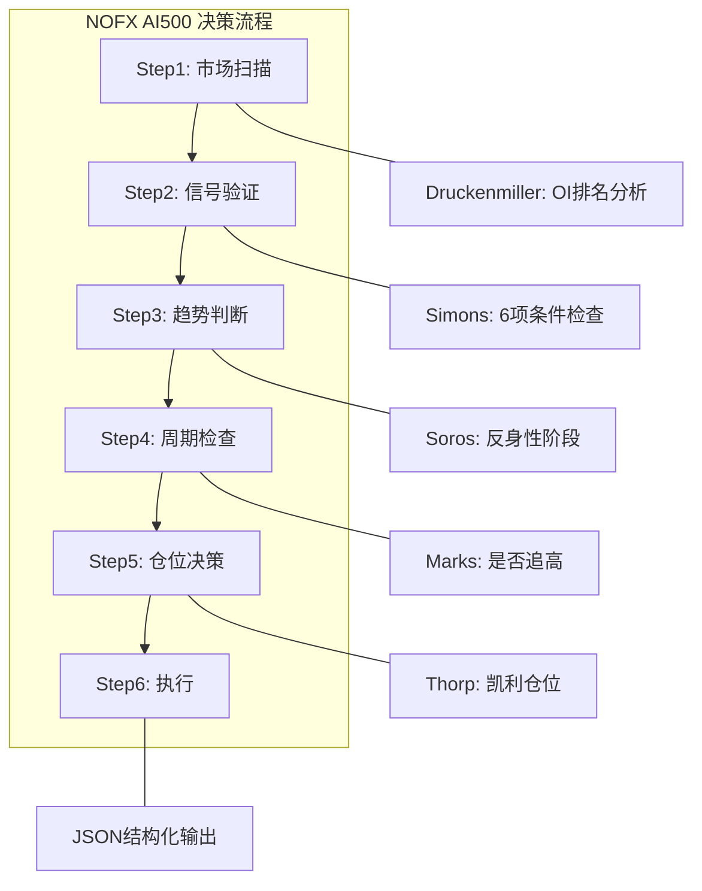

# NOFX AI500 投资人适配说明

> **版本**：v1.5.0 | **更新**：2024-12-14

本文档说明 AI500 量化策略如何映射到 investment-masters-handbook 中各投资大师的核心理念。

---

## 适配概览

AI500 币种的特点（暴力拉盘、只做多、K线+OI 驱动）与以下 5 位投资大师的理念高度契合：

| 大师 | 核心理念 | 在 AI500 的应用 |
|------|----------|-----------------|
| George Soros | 反身性理论 | OI↑ + 价格↑ = 自我强化拉盘 |
| Stanley Druckenmiller | 流动性至上 | OI 排名 = 资金热度 |
| Ed Thorp | 凯利公式 | 置信度 → 仓位映射 |
| Howard Marks | 周期意识 | 不追高，等回调 |
| James Simons | 量化执行 | K线+OI 信号矩阵 |

---

## 详细映射

### 1. George Soros → 反身性理论

**原始理念**（来自 `investors/george_soros.md`）：

```
市场参与者的认知影响基本面，基本面又反过来影响认知，
形成自我强化/崩溃回圈。
```

**AI500 应用**：

```
传统市场：基本面 → 价格
AI500 币：价格 ↔ OI ↔ 情绪 → 自我强化

拉盘循环：
价格上涨 → 空头被套 → 被迫平仓 → 更多买盘 → OI 增加 → 价格继续涨

这就是为什么 AI500 拉起来会"爆拉特别多"
```

**映射规则**：

| Soros 原始规则 | AI500 适配规则 |
|----------------|----------------|
| IF 趋势启动（基本面改善+认知跟上） THEN 顺势建仓 | IF 价格上涨 + OI 大增 THEN 做多/加仓 |
| IF 自我强化阶段 THEN 持有/加码 | IF 连续阳线 + OI 持续增加 THEN 持有 |
| IF 测试极限（认知过度乐观） THEN 警惕、缩仓 | IF 暴涨 + OI 开始减少 THEN 准备止盈 |
| IF 买入论点不成立 THEN 立即止损 | IF OI 大增 + 价格下跌 THEN 止损 |

---

### 2. Stanley Druckenmiller → 流动性至上

**原始理念**（来自 `investors/stanley_druckenmiller.md`）：

```
「流动性推动市场，而非基本面」
关注 Fed 资产负债表、TGA、逆回购等流动性指标。
```

**AI500 应用**：

```
在加密市场，OI（持仓量）= 流动性的直接体现

OI 排名 = 全市场资金关注度
OI 增量 = 资金流入/流出速度

Druckenmiller 看 Fed，我们看 OI
```

**映射规则**：

| Druckenmiller 原始规则 | AI500 适配规则 |
|------------------------|----------------|
| IF 净流动性上升 THEN 做多风险资产 | IF OI 排名进入前 20 + 趋势向上 THEN 做多 |
| IF 净流动性下降 + 高估值 THEN 减仓 | IF OI 排名下滑 + 已盈利 THEN 止盈 |
| IF Fed 政策转向 THEN 先布局成长股 | IF OI 从负转正 + 企稳 THEN 准备进场 |

---

### 3. Ed Thorp → 凯利公式

**原始理念**（来自 `investors/ed_thorp.md`）：

```
Kelly % = (bp - q) / b

- 优势越大，下注越多
- 没有优势，不下注
- 永远不要超过凯利比例（避免破产）
```

**AI500 应用**：

```
我们用"满足条件数"量化优势：

条件数 ≈ 优势大小
仓位 = f(条件数)

简化版凯利映射：
6/6 项 → 15-20% 仓位
5/6 项 → 10-15% 仓位
4/6 项 → 5-10% 仓位
3/6 项 → 3-5% 仓位（试仓）
<3 项 → 0%（不操作）
```

**映射规则**：

| Thorp 原始规则 | AI500 适配规则 |
|----------------|----------------|
| IF 没有数学优势 THEN 不下注 | IF 满足条件 <3 项 THEN 不操作 |
| IF 优势很大 THEN 加大仓位 | IF 满足条件 6/6 项 THEN 仓位 15-20% |
| IF 不确定 THEN 减少仓位 | IF 满足条件 3-4 项 THEN 轻仓试探 |

---

### 4. Howard Marks → 周期意识

**原始理念**（来自 `investors/howard_marks.md`）：

```
「周期永远存在，唯一的问题是我们在哪里。」

极端后必回归，不要在高点追入，不要在低点恐慌。
```

**AI500 应用**：

```
AI500 的周期：

启动期 → 加速期 → 疯狂期 → 顶部 → 回调期 → 企稳期

Marks 的教诲：
- 止盈后不要立即追入（可能在顶部）
- 暴涨 50%+ 后不要追（周期可能到后期）
- 等回调确认再进
```

**映射规则**：

| Marks 原始规则 | AI500 适配规则 |
|----------------|----------------|
| IF 恐慌抛售 + 估值极低 THEN 底部接近 | IF 大跌后企稳 + OI 开始回升 THEN 准备进场 |
| IF 杠杆激增 + 散户涌入 THEN 顶部接近 | IF 暴涨 + 社交媒体热议 THEN 准备退出 |
| IF 「这次不一样」成为共识 THEN 警惕 | IF 刚止盈 + 想立即追入 THEN 等待回调 |

---

### 5. James Simons → 量化执行

**原始理念**（来自 `investors/james_simons.md`）：

```
「我们不用基本面，只用数据。」

消除情绪，机械化执行，让数据说话。
```

**AI500 应用**：

**K线 + OI 信号矩阵**（核心量化工具）：

|  | 价格上涨 | 价格下跌 |
|--|----------|----------|
| **OI↑** | ⭐⭐⭐⭐⭐ 强多（主力做局）→ 做多/加仓 | 🔴🔴🔴 强空（空头入场）→ 观望/止损 |
| **OI↓** | ⚠️⚠️ 弱多（主力出货）→ 止盈/减仓 | 🔴🔴 资金离场 → 空仓等待 |

**6 项量化条件检查清单**：

| # | 类别 | 条件 |
|---|------|------|
| 1 | K线 | 5m/15m 连续 3+ 阳线 |
| 2 | K线 | 站上前高/关键阻力 |
| 3 | K线 | 回调至支撑企稳 |
| 4 | OI | 1h OI 增量 > 3% |
| 5 | OI | 排名进入前 20 |
| 6 | 综合 | 多时间框架一致（15m+1h） |

**映射规则**：

| Simons 原始规则 | AI500 适配规则 |
|-----------------|----------------|
| 数据驱动，消除情绪 | 严格按信号矩阵操作，不凭感觉 |
| 机械化执行 | 满足条件数 → 自动确定仓位 |
| 模型迭代优化 | 记录每笔交易，分析信号有效性 |

---

## 决策流程整合



| 步骤 | 大师 | 核心问题 |
|------|------|----------|
| Step 1 | Druckenmiller | OI 排名 Top 20 有哪些？资金在流入还是流出？ |
| Step 2 | Simons | 满足多少项量化条件？（6项检查清单） |
| Step 3 | Soros | 反身性在哪个阶段？启动/加速/测试极限？ |
| Step 4 | Marks | 是不是在追高？刚止盈想再进？ |
| Step 5 | Thorp | 置信度对应多少仓位？ |
| Step 6 | 系统 | 输出 JSON 结构化决策 |

---

## 输出示例

```json
{
  "action": "OPEN_LONG",
  "symbol": "AIUSDT",
  "confidence": 85,
  "position_size": "10%",
  "entry": 1.2345,
  "stop_loss": 1.1800,
  "take_profit": [1.3500, 1.4200],
  "risk_reward": "3.2:1",
  "reasoning": {
    "soros": "反身性启动阶段，OI+价格同向增加",
    "druckenmiller": "OI排名#8，资金高度关注",
    "thorp": "5/6条件满足，建议仓位10%",
    "marks": "非追高，回调企稳后进场",
    "simons": "信号矩阵显示强多（价格↑+OI↑）"
  }
}
```

---

## 相关文件

| 文件 | 说明 |
|------|------|
| [prompts/nofx_ai500_master.md](../prompts/nofx_ai500_master.md) | 融合五位大师的完整 prompt |
| [nofx_ai500_quantified.json](./nofx_ai500_quantified.json) | NOFX 策略配置（含投资人映射） |
| [investors/george_soros.md](../investors/george_soros.md) | Soros 原始框架 |
| [investors/stanley_druckenmiller.md](../investors/stanley_druckenmiller.md) | Druckenmiller 原始框架 |
| [investors/ed_thorp.md](../investors/ed_thorp.md) | Thorp 原始框架 |
| [investors/howard_marks.md](../investors/howard_marks.md) | Marks 原始框架 |
| [investors/james_simons.md](../investors/james_simons.md) | Simons 原始框架 |

---

## 为什么选择这五位？

| 大师 | 选择原因 |
|------|----------|
| **Soros** | 反身性理论完美解释 AI500 的暴力拉盘机制 |
| **Druckenmiller** | 流动性视角与 OI 排名高度契合 |
| **Thorp** | 凯利公式提供数学化的仓位管理框架 |
| **Marks** | 周期意识帮助避免追高和过度交易 |
| **Simons** | 量化思维确保系统化、去情绪化执行 |

**未选择的原因**：

- Buffett/Munger：长期价值投资，不适合短线交易
- Dalio：全天候配置，与单边做多策略不匹配
- Burry：逆向做空，与"只做多"铁律冲突
- Lynch：成长股估值，加密市场无法直接应用

---

> **核心理念**：投资大师的智慧是跨市场的，关键在于找到正确的映射方式。K线+OI 是 AI500 的"基本面"，五位大师的框架帮你解读这个基本面。

